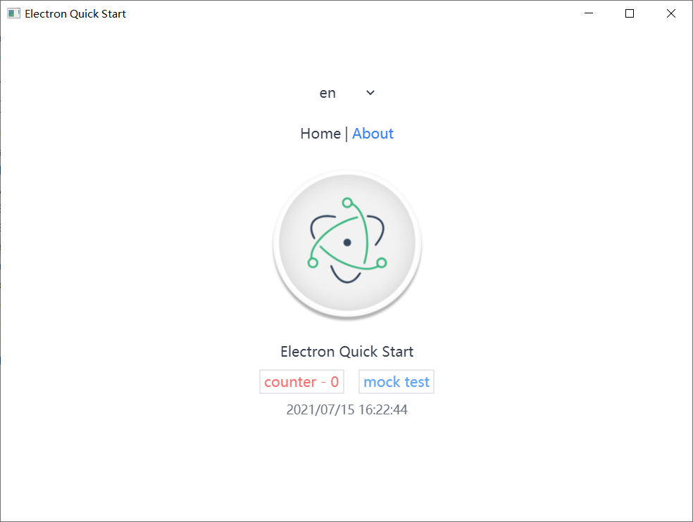

# electron-quick-start
Quick start project with electron &amp; vue3

## Setup taobao mirror
```
npm config set ELECTRON_MIRROR "https://npm.taobao.org/mirrors/electron/"
```
## Project setup
```
yarn
```
## Compiles and hot-reloads for development
```
yarn dev
```
## Compiles and minifies for production
```
yarn build (macOS)

yarn build-win (Windows)
```
## ScreenShot
<p align="center">
  
</p>